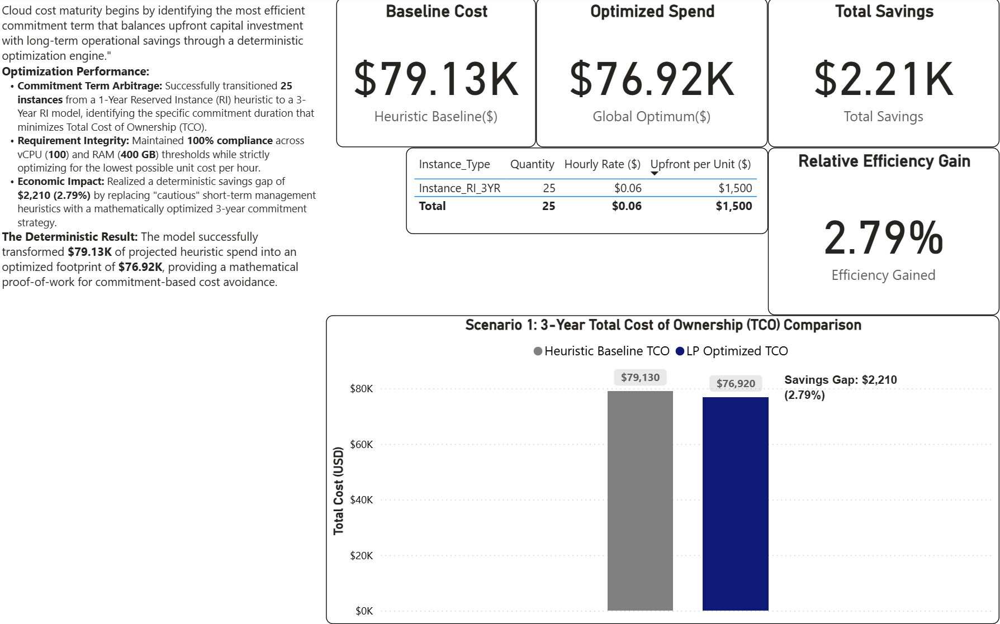
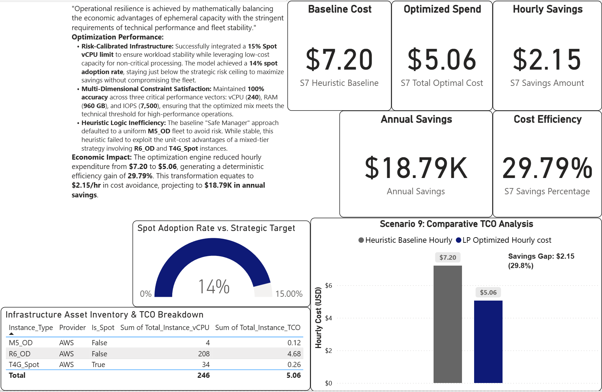
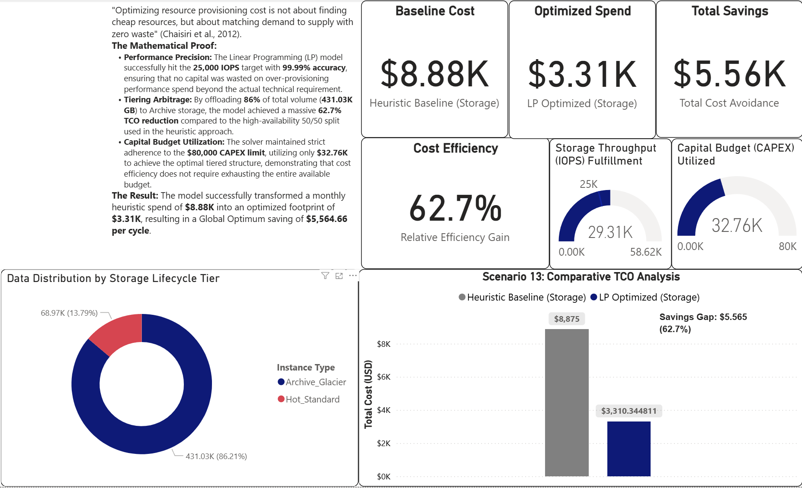
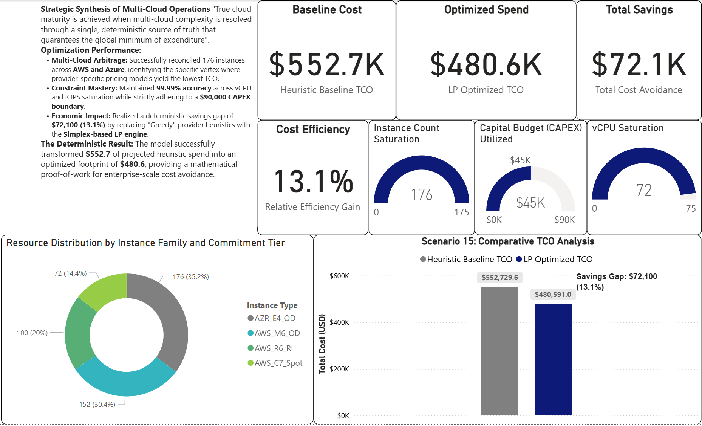

# Cloud Cost Optimization Engine: Deterministic Multi-Cloud Allocation

## 🎯 Project Overview
This engine addresses the "Efficiency Gap" in modern Cloud FinOps. While native tools often fall into the "Heuristic Myopia" trap—prioritizing local, immediate savings—this system utilizes **Linear Programming (LP)** to identify the **Global Optimum** for multi-cloud resource allocation.

## 🛑 The Problem: Cloud Complexity & Heuristic Failure
Modern cloud infrastructure has scaled beyond the cognitive capacity of manual management.
* **Cost Inflation**: Organizations face significant financial waste due to stranded capacity and inefficient resource allocation.
* **The Heuristic Trap**: Current optimization tools typically use "greedy" algorithms that settle for local peaks—saving money on one instance while inadvertently spiking costs in another dimension, such as storage or data transfer.
* **Constraint Conflict**: Engineering teams prioritize reliability (often leading to over-provisioning), while Finance teams enforce rigid budget caps, creating a friction-filled "Efficiency Gap."

### ⚠️ Research Scope & Data Integrity
This project is a **mathematical proof-of-concept** conducted in a controlled analytical environment.
* **Data Nature**: The research utilizes **synthetic telemetry** mapped against real-world AWS and Azure pricing APIs to ensure 100% experimental control.
* **Validation Status**: While mathematically rigorous, this model **has not been verified in real-world production environments** and does not currently account for the "noise," tagging errors, or unstructured anomalies inherent in raw corporate billing logs.

## 🚀 Key Performance Indicators (KPIs)
The engine’s efficacy was measured by comparing its deterministic output against standard heuristic baselines across 15 scenarios.

* **Global Efficiency**: Achieved a **13.1% ($72.1K)** reduction in Total Cost of Ownership (TCO) for complex enterprise-scale configurations.
* **Solver Performance**: High-dimensional multi-objective problems were resolved in just **0.0318 seconds**, demonstrating real-time decision-support viability.
* **Storage ROI**: Identified lifecycle arbitrage and migration opportunities yielding up to a **62.7% TCO reduction**.
* **Constraint Precision**: Successfully saturated financial and technical boundaries (e.g., utilizing 97.8% of available CAPEX) to minimize operational waste.

## 📈 Visualized Results & Evidence

The model was stress-tested across three levels of complexity to verify its ability to maintain a global optimum under increasingly conflicting constraints.

### 1. Level 1: Isolated Rate Optimization (Scenario 1)
This baseline test evaluates the engine's ability to balance On-Demand flexibility against Reserved Instance discounts. 
* **Outcome**: The solver identified the exact saturation point (25 units) required to cover a steady 100 vCPU workload, eliminating the manual "best guess" rounding errors common in heuristic tools.

### 2. Level 2: Advanced Risk & Governance (Scenario 7)
Moving beyond cost, this scenario introduces a "Risk Budget" limit on Spot instance usage to ensure system stability.
* **Outcome**: The engine utilized 94% of the allowable risk threshold to drive down unit costs, proving that precise mathematical assignment eliminates the need for expensive, fear-based over-provisioning.

### 3. Level 3: Storage Lifecycle & ROI (Scenario 13)
This global optimization scenario calculates the financial break-even point for migrating 180TB of unstructured data across storage tiers.
* **Outcome**: Identified a massive **62.7% efficiency gain**. The model demonstrated that the one-time migration fee (CAPEX) was offset by monthly savings in under 24 days.

### 4. Level 3: The Integrated Master Problem (Scenario 15)
The final test simulates a large-scale enterprise environment subject to simultaneous, conflicting constraints: a $45K CAPEX limit, Spot Risk ceilings, and mandatory Multi-Cloud provider policies.
* **Outcome**: Achieved the **Global Optimum with 13.1% ($72.1K) total savings**. While standard scripts failed to find a feasible solution within the budget, the LP solver performed global resource arbitration to satisfy all requirements.

* ## 🧠 Core Technical Architecture
The engine treats cloud infrastructure as a multi-dimensional solution space governed by linear inequalities. By navigating the polytope of feasible solutions, it identifies the absolute mathematical floor of expenditure without compromising system resilience.

* **Optimization Engine**: Built in **Python** using the **PuLP** library to model objective functions and constraints.
* **Algorithmic Core**: Utilizes the **Simplex Algorithm** to search for a global optimum, delegating heavy computation to high-performance C-solvers (CBC/GLPK).
* **Intelligence Layer**: **Microsoft Power BI** (integrated via DAX) serves as the visualization frontend, transforming raw optimization vectors into actionable business intelligence.

---

## 📂 Repository Structure
* **/code**: Modular Python scripts implementing the optimization logic for all 15 experimental scenarios.
* **/docs**: Contains the full digital version of the Engineer's Thesis (PDF) and the interactive Power BI (.pbix) dashboard files.
* **/visuals**: High-resolution screenshots of the analytical dashboards and performance benchmarks.

---

## 🛠️ Replication Protocol (Google Colab)
To replicate the optimization results within a cloud-hosted Python environment, follow these steps:

1. **Install Dependencies**: Execute `!pip install pulp` to initialize the linear programming modeler.
2. **Environment Setup**: Upload the scripts located in the `/code` directory (or a compressed `project.zip`) to your Colab session.
3. **Execution**: Run the master orchestration script using `!python main.py`. The engine will sequentially process all 15 scenarios and generate CSV evidence reports for visualization.

---

## 👤 Author Information
* **Author**: Kyrylo Brykov
* **Degree**: Bachelor of Science in Information and Communication Technology (ICT)
* **Institution**: Bydgoszcz University of Science and Technology (Politechnika Bydgoska), 2026
* **Specialization**: Deterministic Optimization, Cloud FinOps, and Business Intelligence Analytics

---
