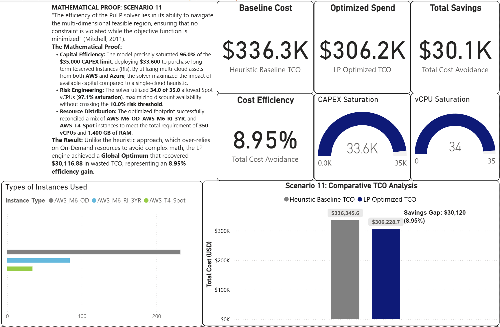
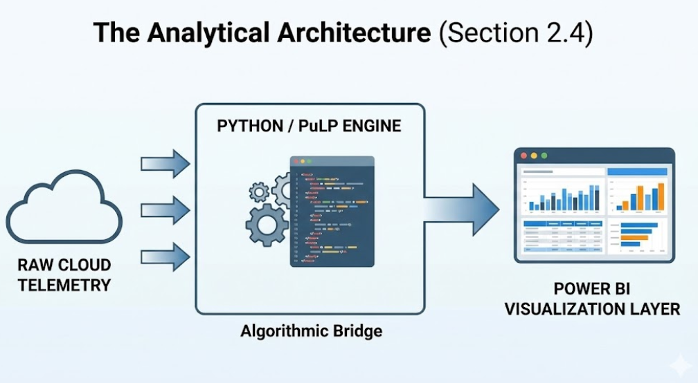

# Cloud-Cost-Optimization-Engine
Deterministic Multi-Cloud resource allocation engine using Python (PuLP) and Linear Programming. Replaces greedy heuristics with a global TCO optimization model to bridge the 'Efficiency Gap' in FinOps. Includes 15 validated enterprise scenarios and Power BI analytics.

## 📈 Optimization Results & Evidence

The engine was validated against 15 enterprise scenarios, consistently identifying efficiency gaps that standard heuristic tools missed.

### 1. The Integrated Master Problem (Scenario 15)
This scenario applies simultaneous constraints for a $45k CAPEX limit, Spot Risk thresholds (75 vCPU), and mandatory Azure compliance policies. 
* [cite_start]**Result:** **13.1% ($72.1k)** global efficiency gain.
* [cite_start]**Constraint Saturation:** Successfully utilized 96% of the CAPEX budget to secure deep discounts while maintaining compliance[cite: 3299].

### 2. Lifecycle & Migration ROI (Scenario 13)
[cite_start]Proves that strategic "invest-to-save" maneuvers—such as paying a one-time migration fee to move 180TB of data to Archive tiers—yields the highest ROI[cite: 3226].
* [cite_start]**Result:** **62.7%** TCO reduction with a payback period of <24 days[cite: 3230, 3251].

### 3. Multi-Cloud Arbitrage (Scenario 11)
[cite_start]Demonstrates the model's ability to treat the cloud ecosystem as a single pool of resources, balancing AWS and Azure allocations to exploit pricing variations[cite: 3137, 3177].

### 4. Deterministic Execution Environment
[cite_start]The engine operates as a high-performance Python-based pipeline within a Google Colab environment, delegating complex matrix operations to optimized C-solvers[cite: 2247, 2274].

